# Deploy YOLOv5 with OctoML to Docker Desktop

 1. [Introduction](#introduction)
 1. [Benefits of deploying YOLOv5 with OctoML](#benefits-of-deploying-yolov5-with-octoml)
 1. [Select your YOLOv5 candidate model](#select-your-yolov5-candidate-model)
 1. [Install Docker Desktop](#install-docker-desktop)
 1. [Create Client Code Container](#create-client-code-container)
 1. [Clone YOLOv5 repo, install requirements and export model](#clone-yolov5-repo-install-requirements-and-export-model)
 1. [Run OctoML CLI to package and deploy YOLOv5](#run-octoml-cli-to-package-and-deploy-yolov5)
 1. [Verify Triton and networking config](#verify-triton-and-networking-config)
 1. [Run Inference to Triton in OctoML model container](#run-inference-to-triton-in-octoml-container)
 
## Introduction

This follow-along tutorial is designed to help you quickly get YOLOv5 computer
vision models deployed to your local computer for inference. Below you’ll be
introduced to the [OctoML CLI](https://try.octoml.ai/cli/), a free command line
utility that packages machine learning models into deployable Docker containers
with NVIDIA Triton Inference Server. When you’re ready to deploy to production,
OctoML CLI can also be used to accelerate and deploy YOLOv5 to over 100 instance
types in AWS, Azure and GCP.

Here is the architecture of what we will be building. Your local machine will
run the OctoML CLI and Docker Desktop with two containers. The first container
will run client code to pre-process the image, request inference from Triton
Inference Server (running in a different container) and run post-processing to
embed the bounding boxes for object detection onto your original image. We will
be creating this client code container manually. The second container will be
created with OctoML CLI automatically and will host your chosen YOLOv5 model and
Triton.

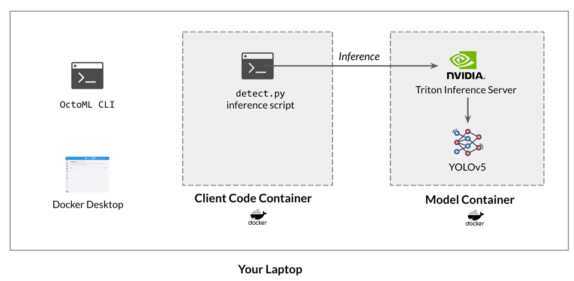

Let’s start by reviewing the YOLOv5 models and their use cases.

## Benefits of deploying YOLOv5 with OctoML

Ultralytics provides [10 pretrained
checkpoints](https://github.com/ultralytics/yolov5#pretrained-checkpoints) of
YOLOv5 ranging in size and prediction accuracies. The first 5 models below,
YOLOv5n - x, take in images of size 640 x 640 pixels, while the second 5 models,
ending in ‘6’, accept larger images of size 1280 x 1280. Note that the
pre-processing code we will use in detect.py automatically resizes larger images
to the appropriate size, so you don’t have to. As you can see, the larger
models, ending in 6, have higher mean Average Precision for object detection,
but also slower inference times in the speed columns. The table below from the
Ultralytics github shows the unoptimized inference run times for the models on
an AWS p3.2xlarge instance with NVIDIA’s V100 Tensor Core GPU. These speeds
provide a high-level guide for model selection, but your actual run time can
vary significantly depending on your chosen cloud instance, CPU or GPU target,
acceleration engine (such as Apache TVM, ONNX Runtime or TensorRT) and specific
YOLOv5 model variant.

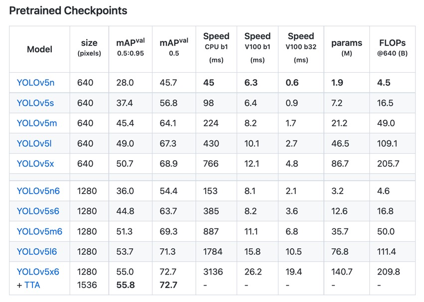

At OctoML, we ran the most popular model variant, YOLOv5s, which is a good
compromise of accuracy and speed, and a great model to start with, through
OctoML’s SaaS product to understand how inference speeds can vary. OctoML
optimizes ML models for production deployment via various engines, including
Apache TVM, ONNX Runtime and TensorRT, and automatically provides you with the
fastest implementation of the model for your chosen hardware. Take a look at the
inference time range below from 4.20 ms on NVIDIA V100 (with an on-demand hourly
rate of [\$3.06](https://aws.amazon.com/ec2/pricing/on-demand/)) to 42.93 ms on
Graviton3 (which an on-demand hourly rate of
[\$0.578](https://aws.amazon.com/ec2/pricing/on-demand/)) across AWS and Azure
targets (prices accurate as of Sept 2022).

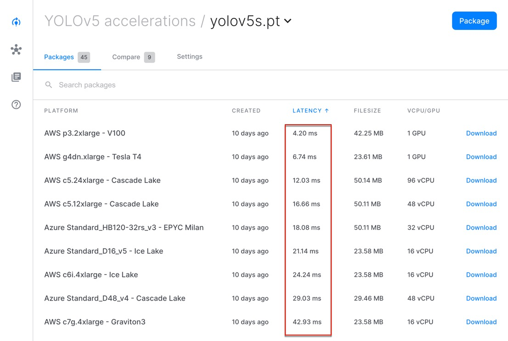

OctoML makes it easy to achieve hardware independence by accelerating your model
with multiple optimization engines and benchmarking your model across 100+
hardware targets in AWS, Azure and GCP.

## Select your YOLOv5 candidate model

The first step with productionizing ML models is typically just deploying it
locally to a developer’s laptop and prototyping some inference runs through it.
This is where we will also start.

Start by selecting a YOLOv5 model and copy the link to download it. In this
tutorial, we’ll use
[YOLOv5s](https://github.com/ultralytics/yolov5/releases/download/v6.2/yolov5s.pt),
but any of the models will work:

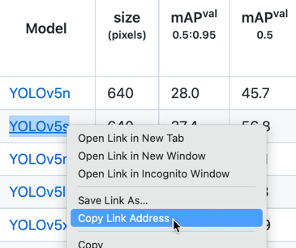

You will need your selected model’s download link in the upcoming section “Clone
YOLOv5 repo, install requirements and export model”.

In a typical workflow, you would fine-tune the model for your use case with
custom data or re-train it on new data from scratch. In this tutorial, we’ll
skip that and just detect the 80 object categories in the [COCO 2017
dataset](https://cocodataset.org/#home), which is the dataset that all 10 YOLOv5
models have been pre-trained with. If you do decide to fine-tune or retrain the
model, you can still follow the same steps below to deploy your updated model.

## Install Docker Desktop

If you don’t already have Docker Desktop installed locally, go ahead and
[install it now](https://www.docker.com/products/docker-desktop/).

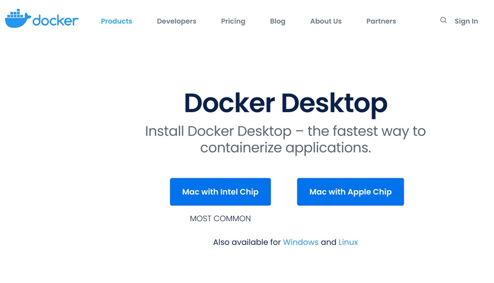

Then start Docker Desktop and you should be greeted with the Docker Desktop UI:

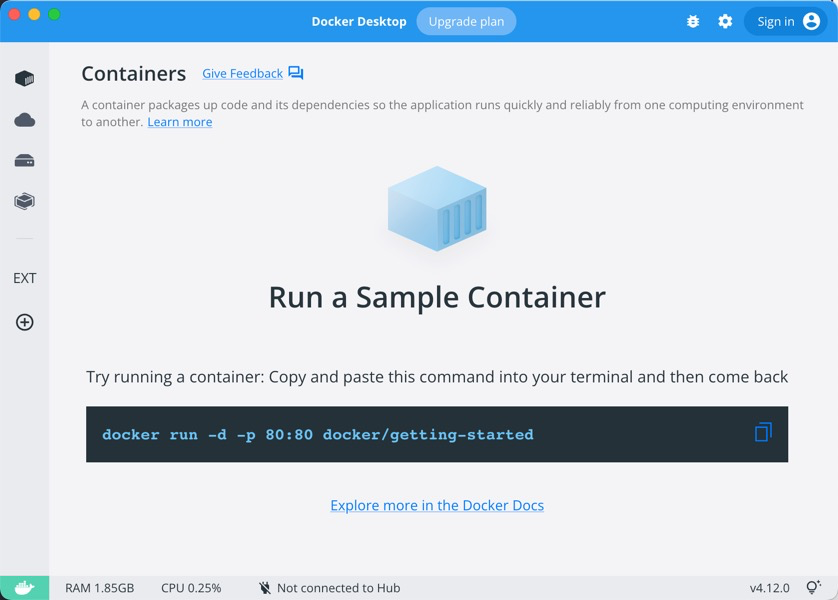

Try running docker info from your laptop’s command prompt to ensure that the
docker server is running correctly:

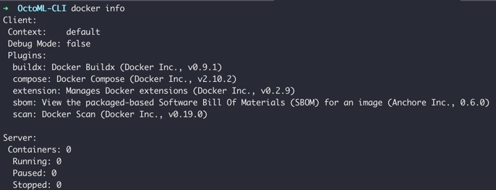

## Create Client Code Container

The main reason we will create a special container to run the
[detect.py](https://github.com/ultralytics/yolov5/blob/master/detect.py)
inference script is to avoid needing to install various
[dependencies](https://github.com/ultralytics/yolov5/blob/master/requirements.txt)
locally on your machine. By creating a container for the client code, we have a
clean, isolated environment and you won’t need to install ML libraries locally
on your machine.

*Note, the following instructions have been tested on a M1 Macbook.*

Run docker pull to pull an baseline image for the client container from the
PyTorch registry:

``` shell
docker pull pytorch/pytorch:1.12.1-cuda11.3-cudnn8-runtime
```

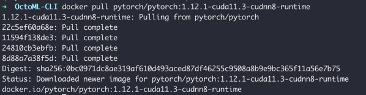

When the download is completed and the image has been extracted, you can verify
that the image is present locally with:

``` shell
docker images
```

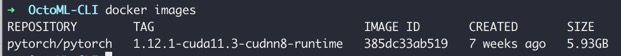

Now you are ready to run the Docker container. We will connect the container to
our host machine for easy communication between our laptop and the future model
container. We will also bind a mount point from a local directory (in red) to a
folder in the container. You will want to edit the directory path in red below
to a local folder on your laptop.

``` shell
docker run -i -t --network host \
  --mount type=bind,source=/Users/sameer/OctoML-CLI-tutorial/docker-mount,target=/workspace/docker-mount \
  pytorch/pytorch:1.12.1-cuda11.3-cudnn8-runtime
```

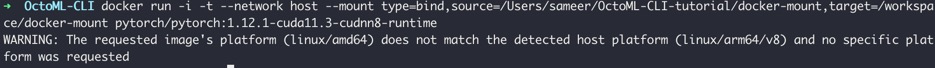

If you get a warning about the host platform like in the screenshot above, you
can safely ignore it.

In the Docker Desktop UI, under the Containers tab, you will now see the
container running with a randomly generated name. Click the 3 dots to bring up
the actions menu and choose “Open in terminal”

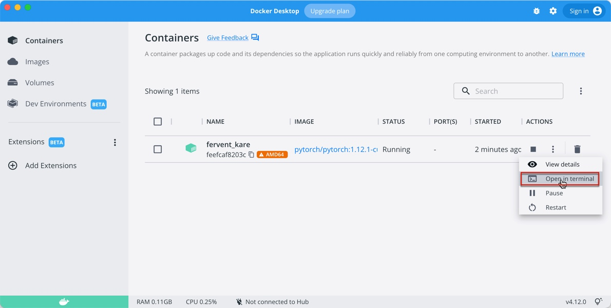

Next optionally, open an external terminal if you prefer:

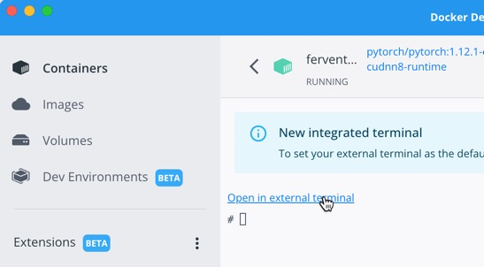


## Clone YOLOv5 repo, install requirements and export model

Let’s prepare the client container for the YOLOv5 client code. First update the
package lists:

``` shell
apt-get update
```


Install Git:

``` shell
apt install git-all
```

Approximately 811 MB of disk space will be used to install git-all. Select Y
when you’re prompted to continue with the installation. The Git install will
take about 5-10 minutes. When promoted, choose your geographic location and then
the closest city:

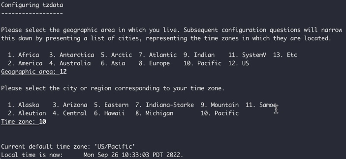

Clone the yolov5 repository:

``` shell
git clone https://github.com/ultralytics/yolov5
```


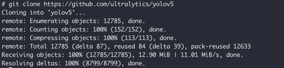

Change directory into the new folder and install the requirements.txt file:

``` shell
cd yolov5
pip install -r requirements.txt
```


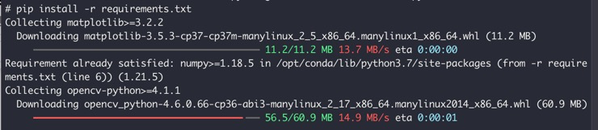

Install wget and download the yolov5s model to the container. You can switch the
download link to whichever model you selected earlier in this tutorial.

``` shell
apt install wget
wget https://github.com/ultralytics/yolov5/releases/download/v6.2/yolov5s.pt
ls
```

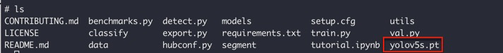

Finally, convert the .pt PyTorch model to the ONNX format, so it’s compatible
with OctoML CLI:

``` shell
python export.py --weights yolov5s.pt --include onnx
```

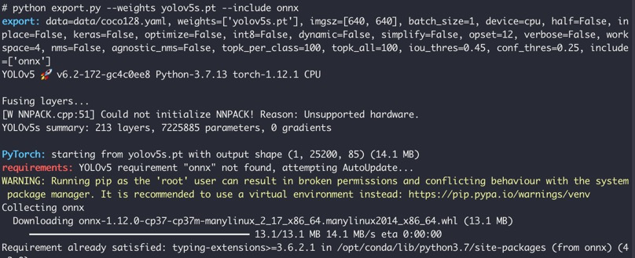

The conversion will take about 5 minutes and the onnx package will be
automatically installed. When completed, you will see a .onnx model file
locally:


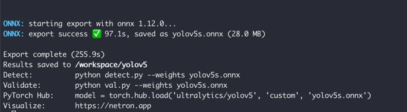

Re-run ls and you will see the new ONNX model file:

``` shell
ls
```


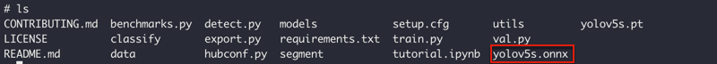


This is the ONNX file that we will pass into the OctoML CLI in the next section
for packaging into a OctoML model container with Triton. Copy the ONNX model
file to the docker mount that is binded to a folder on your host machine:

``` shell
cp yolov5s.onnx /workspace/docker-mount
```


Verify that you see the ONNX file from your laptop:

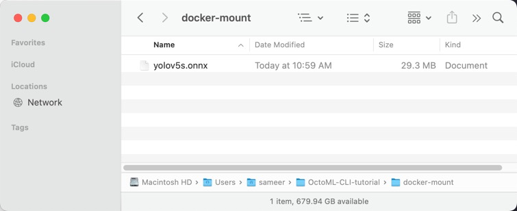

## Run OctoML CLI to package and deploy YOLOv5

You are now ready to package and deploy your selected YOLOv5 model! Go go the
[OctoML CLI landing page](https://try.octoml.ai/cli/) and download the .zip or
.tar.gz file for your local machine:


In Chrome, you may need to choose “Keep” to confirm that you want to download
this file:

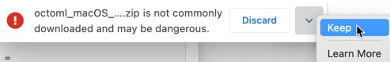

Once OctoML CLI is downloaded, extract or unzip the file. Then, if you are
running on OS X, you will need to override macOS’s system security and confirm
that you want to run this file. Right click on the octoml executable file and
Open With -> Terminal:


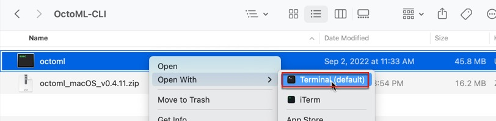

On the next popup, choose Open:

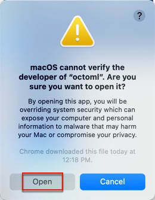

Now you can close the terminal window:

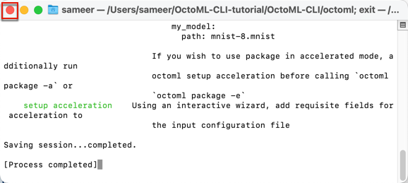

Using your local machine’s Finder app or directory browser, copy the ONNX format
of your selected YOLOv5 model from the docker-mount folder to the OctoML CLI
download folder:

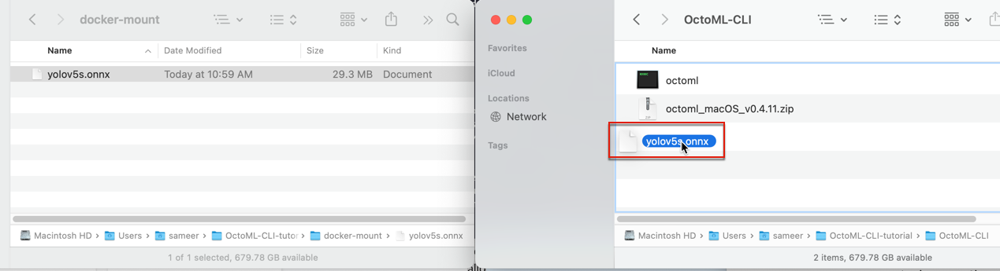


Launch your preferred Terminal application (here we are using iTerm2 on macOS)
and navigate to the directory where you downloaded the OctoML CLI and run ls to
verify that the ONNX model is there:

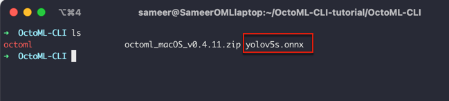

You are now ready to run OctoML CLI!

From the directory where you have OctoML CLI extracted, run:

``` shell
./octoml init
```


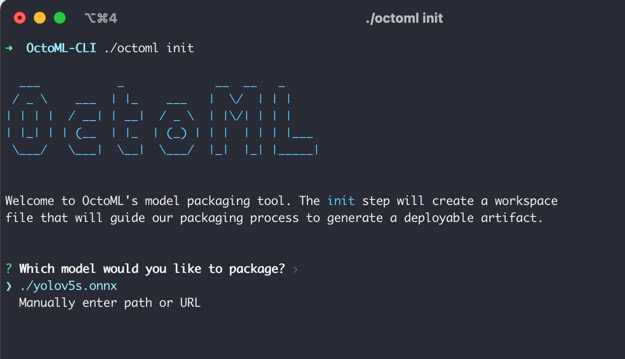


The ONNX formatted YOLOv5 model should be automatically detected since it’s in
the same folder. Hit enter to choose it and a new octoml.yaml file will be
created:


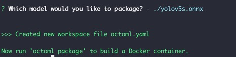

Next run the package command to package the model into a container. Note that
the first time you run this command a 5+ GB base image will be downloaded, which
can take between 5 to 20 minutes.

``` shell
./octoml package
```


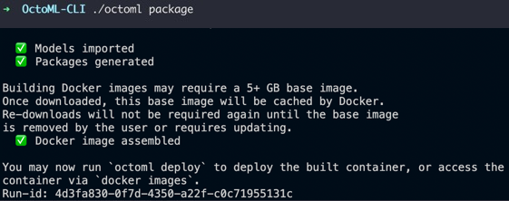

Finally, run the deploy command to start running the container locally:

``` shell
./octoml deploy
```

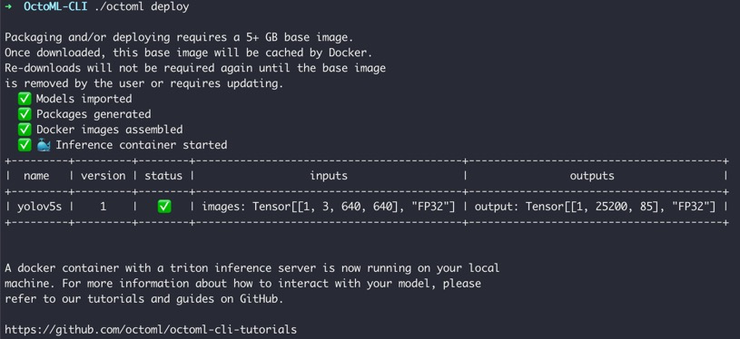

You will now see the new OctoML model container with Triton running in Docker
Desktop:


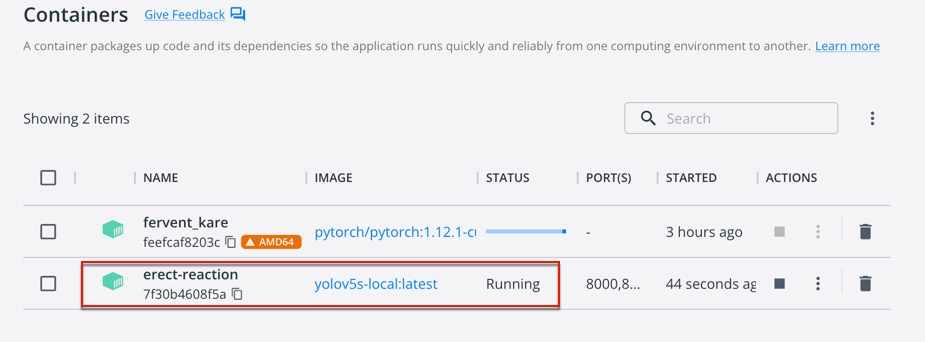

If you click on the OctoML container, you will see the Triton Inference Server
logs:


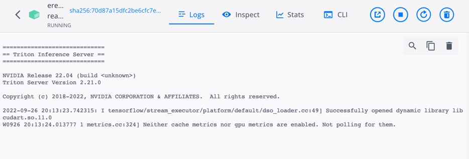

## Verify Triton and networking config

Before running inference, it is a good practice to start by verifying that the
Triton server is responding and your networking is correctly configured.

From your local machine’s terminal (where you ran the OctoML CLI commands), run
the following command to connect to Triton and collect statistics:

``` shell
curl -v localhost:8000/v2/models/stats
```


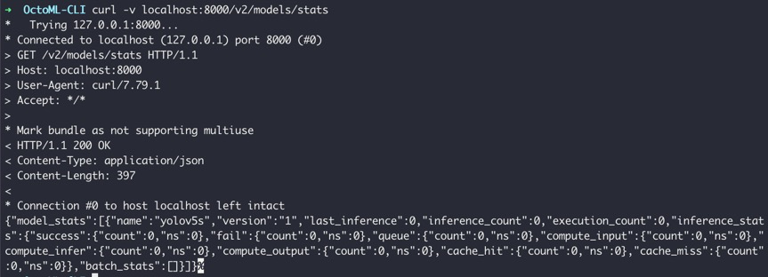

Next, let’s verify that the client code container can also talk to Triton.
Switch to the Terminal window for the client container (where you git cloned the
YOLOv5 repo) and install curl:

``` shell
apt install curl
```


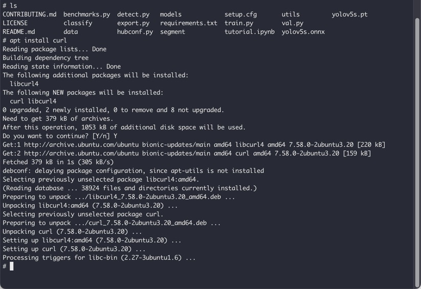

Run the same curl command to see statistics from Triton:

```shell
curl -v localhost:8000/v2/models/stats
```


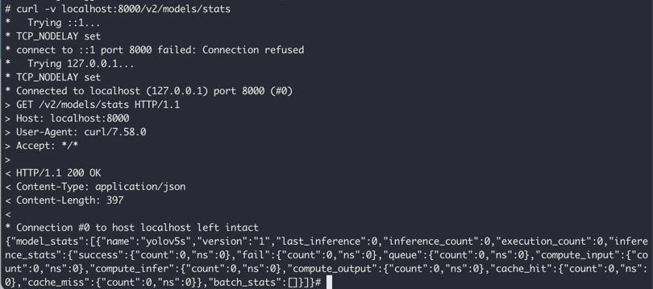

## Run inference to Triton in OctoML model container

We now have our local architecture built out and are ready to run inference
between the two containers:


Start by selecting an image that you want to run inference again. For this
tutorial, we’ll use this image of [a guy riding a
bike](https://croftonbikedoctor.files.wordpress.com/2017/06/images-einstein.jpg):


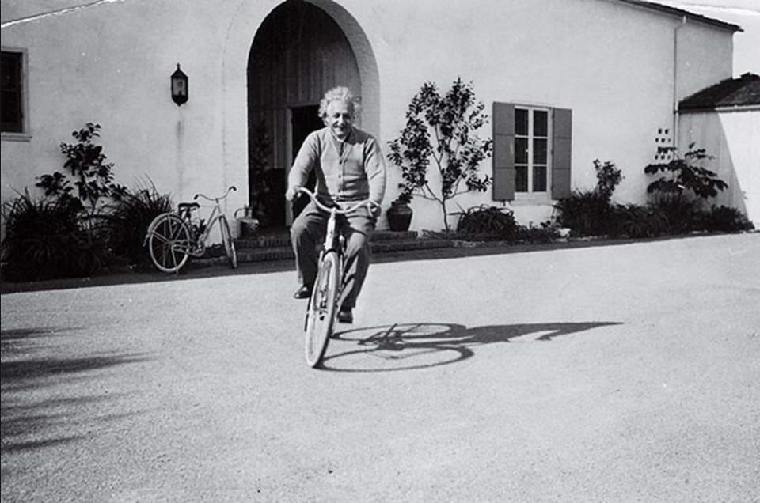

Store your selected image on your host machine’s docker-mount folder:

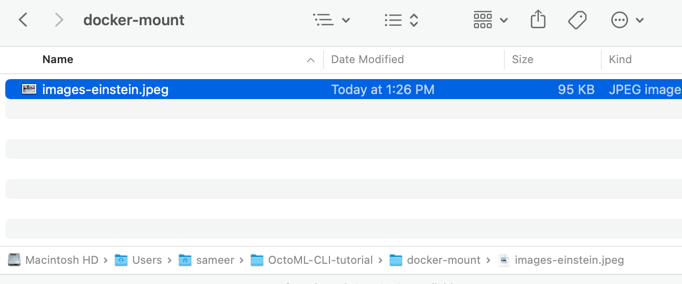

Switch to the Terminal window for the client code container (where you git
cloned the YOLOv5 repo), and run the detect.py script from the /workspace/yolov5
subfolder. Note that Triton Client will be automatically installed.

``` shell
python detect.py --source /workspace/docker-mount/images-einstein.jpeg \
  --weights http://localhost:8000
```


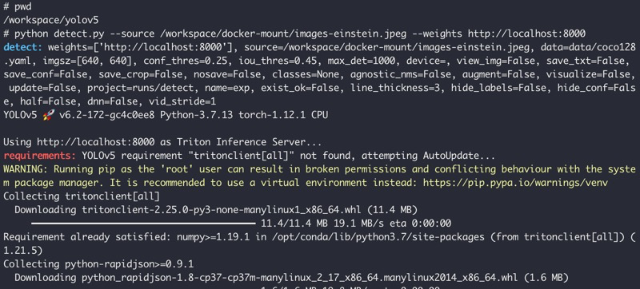

In a minute, you’ll see the results saved to a local sub-directory such as
runs/detect/exp:

``` shell
ls runs/detect/exp
```


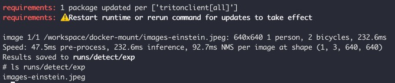

Copy the emitted file from the runs directory to your shared docker-mount
directory and rename it to *-output.jpeg so you can open it in your host
machine:

``` shell
cp runs/detect/exp/images-einstein.jpeg \
  /workspace/docker-mount/images-einstein-output.jpeg
```

Open the new output file to verify that YOLOv5 inference successfully added
bounding boxes to the original image:


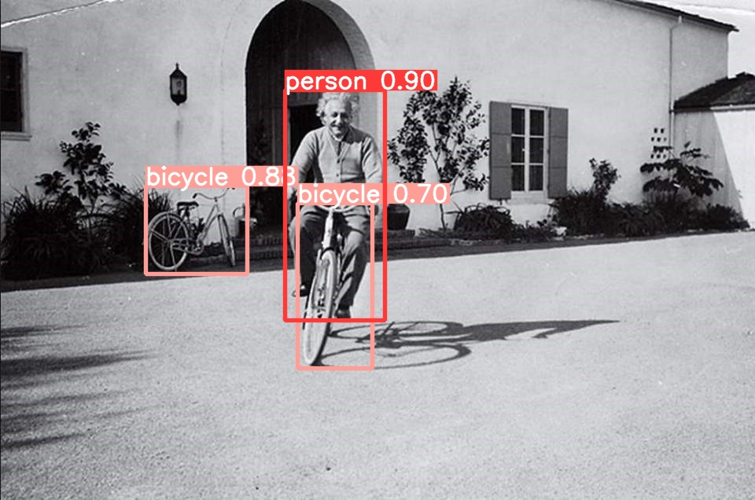

